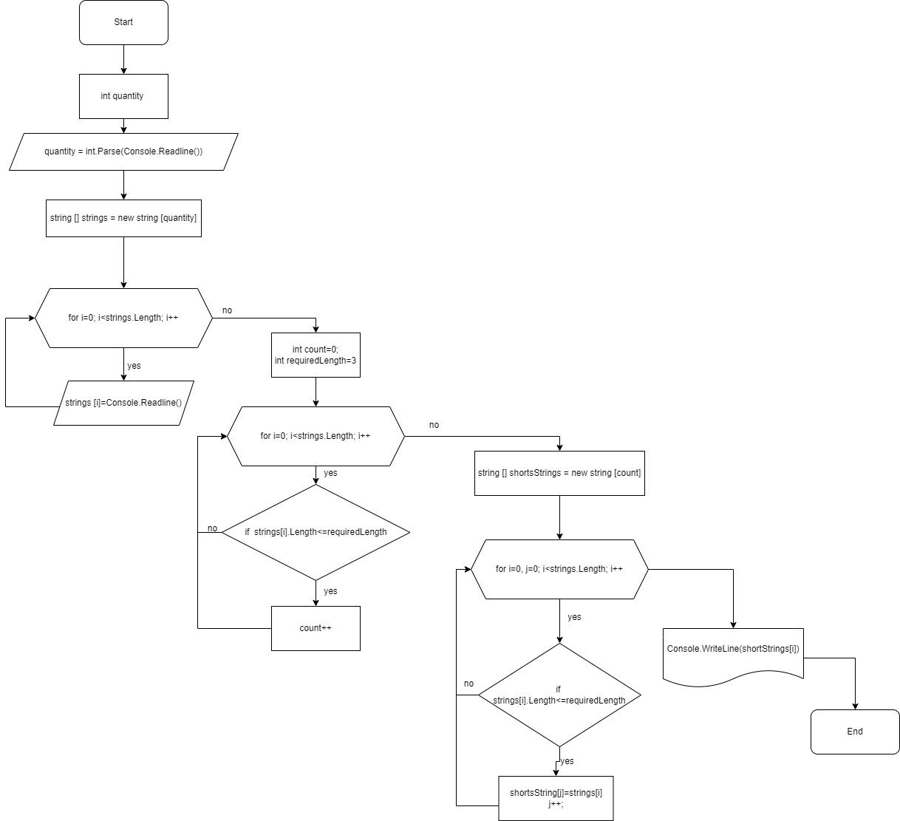

## Для чего нужна эта программа
Данная программа из имеющегося массива строк формирует массив из строк, длина которых меньше либо равна заданному количеству символов (в данном случае 3 символа).

## Этапы выполнения программы:
1. Первоначальный массив строк вводится с клавиатуры. Для этого сначала уточняется какое количество строк будет введено, после этого создается массив нужного размера и заполняется полученными с клавиатуры данными. Для заполнения используется цикл *for*, метод *Console.ReadLine()*.
2. Программа считает количество строк в полученном массиве, длина которых меньше или равна заданному значению. Для подсчета используется счетчик *count*, цикл *for*, условие *if*.
3. Создается новый массив строк, размер которого равен количеству строк, длина которых меньше или равна заданному значению и заполняется этими строками. Для заполнения используется цикл *for*, условие *if*. 
4. Новый массив выводится на экран c помощью метода *PrintArray()*.

Алгоритм выполнения программы:

